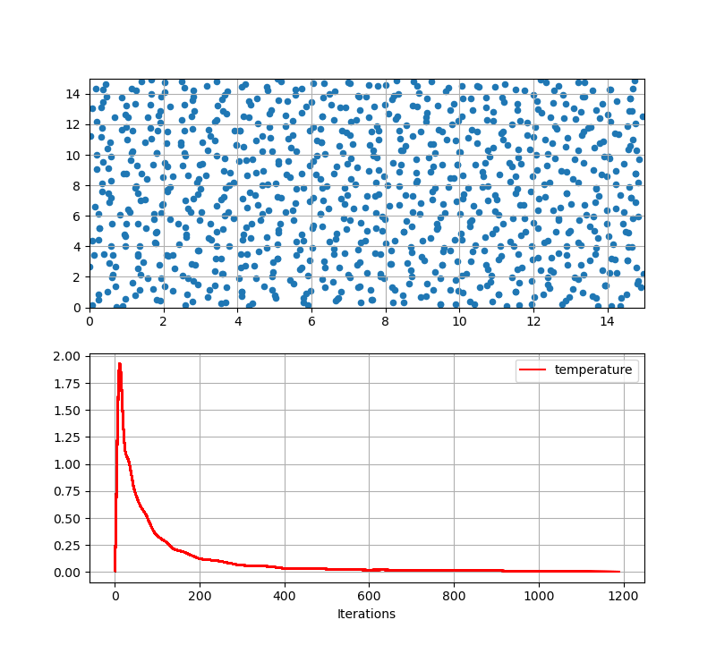
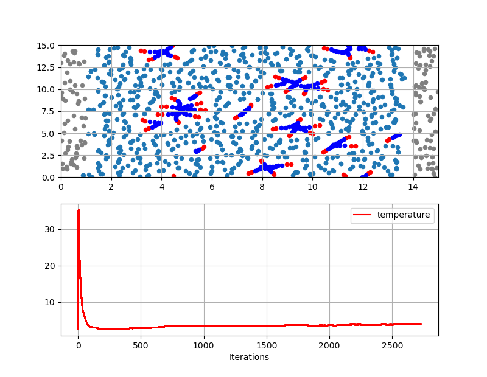
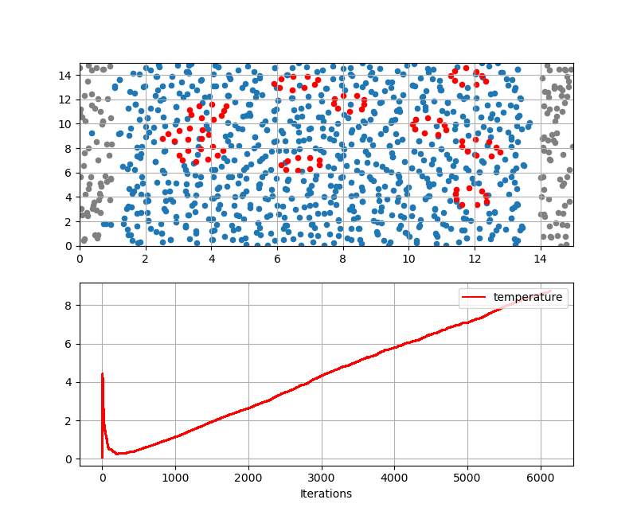

# Dissipative Particle Dynamics
### Assignment 4 Particles Method
To run the experiments, use Cmake. Some instructions within CmakeLists.txt are platform-dependent. So, ensure you have changed hard-coded linking.\\
Thank to [matplolibcpp](https://github.com/lava/matplotlib-cpp) for the plotting library in cpp.
Args to pass:
```bash
./AS4PM delta_t
```
where delta_t is a double (seconds)
### Ex a)



### Ex b)




https://github.com/filippocasari/DissipativeParticleDynamics/assets/49616196/4743c911-e781-4c7e-a396-4a0b58a42c07


### Ex c)



__NOTE__: sometimes, the program does not run properly because matplotlibcpp is not maintained anymore, and crashes. However, if this happened, you may try several times. 
